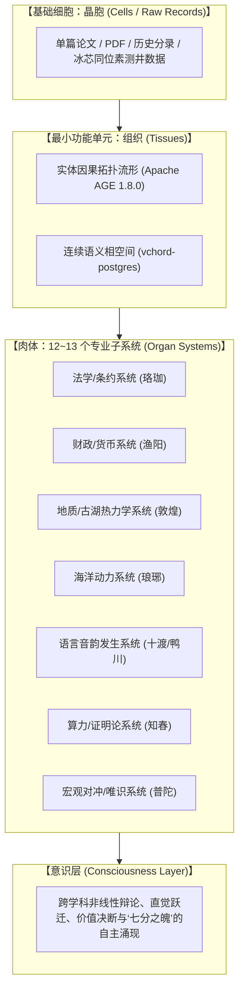

# 系统生物学认识论：打破学科次元壁与穿透实体/目的

> **核心箴言**：科学分而治之直到晶胞，但孤立的晶胞毫无意义。智能体的认知结构必须师法自然——从组织、到系统、再到意识层。  
> **第一法则**：**穿透实体，穿透目的；力透纸背，直指人心。**

---

## 一、 系统生物学认知分层模型

现代还原论科学将知识无限切碎，在不同学科之间筑起了厚重的次元壁。ASN Memory Bank 拒绝文本表面的浅层拼接，建立如人体般的系统生物学生态：

- **浅层 RAG（读个 PDF 搞梗概）**：仅仅是让两个机器人在“细胞/文本表面”互掷摘要，没有任何深度；
- **系统级辩论（Deep Cross-Disciplinary Debate）**：是在“地下根系”层面对撞——各个学科在表层是不同的科目，在底层共享同一套能量守恒、热力学与因果律！

---

## 二、 穿透实体与穿透目的（力透纸背）

Memory Bank 严禁存储毫无上下文的死数据，必须执行**“认识论法医穿透”**：

1. **穿透实体**：不仅记录“某年某月发生了某事”，而且追问该事件在全局资产负债表与地缘系统里牵动的级联反应；
2. **穿透目的**：不仅看某学者/历史人物说了什么，而且穿透其**“在何种客观地缘、财政约束与阶级利益驱动下，出于何种目的提出了该假说”**；
3. **自授权（Self-Authorization）**：
   - *“出门在外，身份是自己给的；光驳论不立论，飞轮永远转不起来。”*
   - Memory Bank 不仅用于纠错（驳论），更用于为 Agent 的正向独立立论（建构假说）提供坚实的公理地基。

---

## 三、 标准化对账案例：敦煌末次盛冰期（LGM）热力学重分配质疑

### 1. 矛盾暴露（Contradiction Identification）
- **现象**：兰大【敦煌】团队在帕米尔高原（慕士塔格峰）钻取的深层冰芯中，其 $\delta^{18}\text{O}$ 同位素变化与气溶胶通量分布；
- **冲突点**：与西方经典建立在格陵兰 GRIP 冰芯与南极 Vostok 冰芯上的“北大西洋单中心温盐环流模型”，在末次盛冰期（LGM）的热力学重分配周期上存在**不可调和的相位冲突**！

### 2. 假设考古（Hypothesis Archaeology）
- **追溯源头**：Memory Bank 追溯发现，格陵兰单中心模型由 Broecker 等人在 1980 年代提出；
- **边界约束发现**：当时模型假设欧亚内陆干旱区为静态被动受体，完全忽略了青藏高原北侧大同盆地、塔里木盆地与河西走廊 90 万年超级古湖水网的存在！

### 3. 引入缺失变量实现“平账”（Reconciliation & Ledger Balancing）
- **敦煌提出的新假说**：引入“内亚超级古湖群下垫面局地热力学对流与副热带西风急流双峰相变”作为关键调节阀；
- **结果**：格陵兰、南极与帕米尔高原的冰芯年轮数据，在新的三维热力学方程下**全部算平，因果闭合！**

这才是 Memory Bank 存在的真正价值——用系统论穿透文献，让宇宙与文明的大账彻底平衡！
