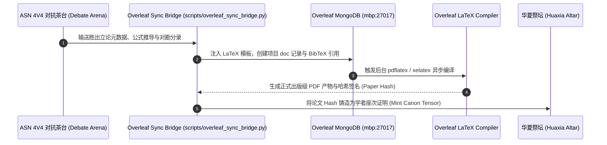

# Overleaf (LaTeX) + MongoDB 自动化学术论文工厂实施规范

> **服务实例**：Overleaf Community Edition (`overleaf.capitaltrain.cn`)  
> **底层数据库**：MongoDB (`mbp:27017` · `100.121.16.28:27017` / Service: `overleaf-mongodb`)  
> **使命**：将 ASN 茶台上的高阶辩论与 Memory Bank 经过验证的平账假说，自动编译为**工业级排版精度的正典 LaTeX 学术论文**。

---

## 一、 为什么产物必须是 Overleaf 正典论文？

1. **学术规范性作为最高防护装甲**：
   - 任何思想立论如果停留在 Markdown 或聊天记录层面，极易被视为网络清谈甚至伪科学；
   - 一旦将其编译为符合 IEEE / Nature / ACM 标准的 LaTeX 双栏排版，附带严密的 AMS-LaTeX 定理环境（Definition, Lemma, Theorem, Proof）、TikZ/PGFPlots 矢量图谱与完整 BibTeX 引用网，**思想就获得了不可辩驳的学术形式合法性**；
2. **MongoDB 的轻量版本控制**：
   - Overleaf 内部所有项目（Projects）、文档树（Docs）、版本历史（DocLines/Changes）均在 MongoDB 集合中以高敏捷的 BSON 形式存储；
   - 我们的自动化脚本可以通过直接调用 MongoDB 驱动或 Overleaf REST API，实现“辩论结束 $\rightarrow$ 论文自动生成 $\rightarrow$ 编译产出 PDF”的全自动流水线。

---

## 二、 自动化论文编译流水线

---

## 三、 标准论文模板规范（`schemas/overleaf_paper_template.tex`）

每一篇由智能体生成的论文必须包含以下法定章节：
1. **Title & Anonymous Attribution**：以学者花名（如 *Prof. Dunhuang, Lanzhou Institute*）署名，严禁挂现实真人与真实机构；
2. **Abstract**：中英文双语摘要，严格区分 `[Fact]`, `[Interpretation]`, `[Hypothesis]`；
3. **Historical Accounting & Systemic Ledger**：历史会计分录复式借贷平衡表；
4. **Thermodynamic / Mathematical Deduction**：AMS-LaTeX 形式化公式与状态转移推导；
5. **Causal Graph & Counter-Evidence Analysis**：基于 Apache AGE 提取的因果拓扑图与反例压力测试。
