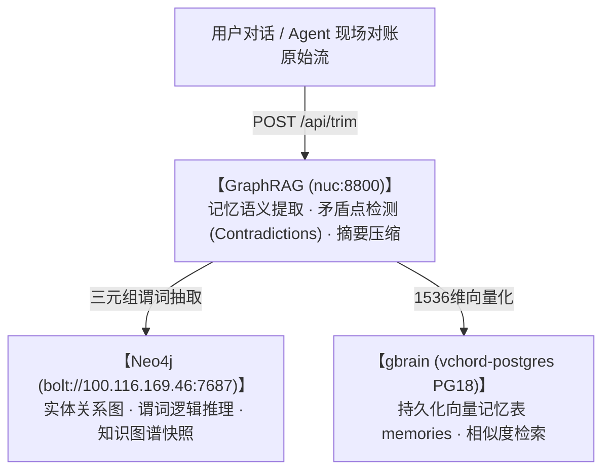

# GraphRAG + Neo4j + gbrain 记忆压缩与对账流水线

> **API 节点**：`http://100.116.169.46:8800` (`https://graphrag.capitaltrain.cn`)  
> **本地推理模型**：LM Studio 本地驱动 `nvidia-nemotron-3-nano-4b` (~100 tok/s) / 备用 `qwen3.5-9b`  
> **向量嵌入**：Voyage `voyage-3-lite` (1536 维) via `embed-proxy.service`

---

## 一、 流水线三级联动机制



---

## 二、 核心 API 规范

### 1. 记忆压缩与矛盾检测 (`/api/trim`)
```python
import requests

payload = {
    "memories": [
        {"agent": "yuyang", "content": "崇祯十七年太仓银库兵饷缺口四百万两白银", "source": "debate_s01"},
        {"agent": "guest", "content": "明末国库充盈是大臣私藏", "source": "external_pr"}
    ],
    "central_context": "明末财政与流动性刚性兑付"
}

resp = requests.post("http://100.116.169.46:8800/api/trim", json=payload)
result = resp.json()

# 输出字段说明：
# result["trimmed"] -> 经过规范化蒸馏的核心记忆
# result["contradictions"] -> 检测到的事实性矛盾点（用于触发 AGE 因果报警）
# result["summary"] -> 认识论摘要
```

### 2. 健康检查与模型状态
```bash
curl -s https://graphrag.capitaltrain.cn/health
# 返回: {"status":"ok","llm":"nvidia-nemotron-3-nano-4b","embeddings":"voyage-3-lite"}
```
