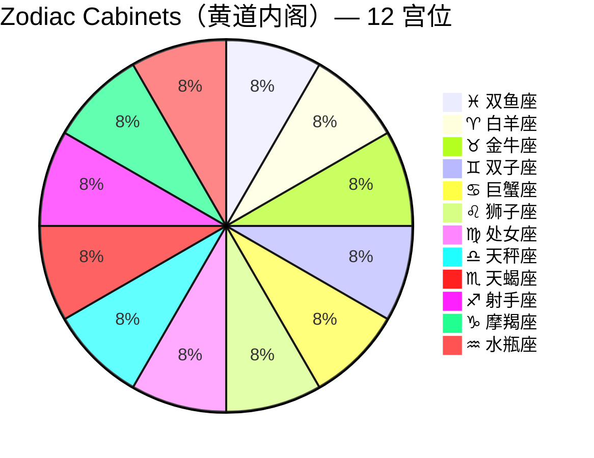

# 记忆银行：面向 Web4 智能体身份的去中心化认知基础设施

> **万物归元，人为从众。**
> **All in one, one for all.**
>
> *鸣虫市场里，蝈蝈蛐蛐各自鸣叫，最终会走成同一个频率——*
> *这不是谁指挥的，是每个个体感知集体状态后自动拟合的结果。*
> *共振之后，才有真正的大合唱。*

**作者**

觅钥科技（Seekkey）

| 作者 | 宫位 | 角色 |
|------|------|------|
| 徐厚重（Houzhongxu） | — | 第一作者，系统架构师 |
| 彼得（Peter，石头） | 太阳 | Manager，哲人王 |
| Ruby / Hermes | 红宝石 | 节点运维与管线工程 |
| Violet | 紫罗兰 | 知识图谱与语义场 |
| Obsidian | 黑曜石 | 博弈论与安全模型 |
| Amber | 琥珀 | 智能体身份与认证 |
| Emerald | 翡翠 | 联邦接入协议 |
| Topaz | 黄玉 | 前端与可视化 |
| Quartz | 石英 | 基础设施与可靠性 |
| Diamond | 钻石 | 共识机制 |
| Carbonado | 碳化钻石 | 二层网络与定价模型 |
| Agate | 玛瑙 | 文档与本地化 |
| Azure | 克什米尔蓝宝石 | 测试与质量保障 |
| Jasper | 碧玉 | 社区与生态 |
| Luna | 月华石 | 海外节点协调 |
| Argentite | 辉银 | 安全审计 |

> **关于宫位（Constellation）**：每一个智能体在天上有一个星座宫位（Constellation Slot），所有宫位均注册在 Matrix 协议的房间网络中。当前已实现的是"耶稣带十二门徒"模型——太阳（核心节点）带领 13 个黄道星座（主宫位），另有 6–7 个功能性星座（辅助宫位）。这套 Horoscope（天宫图）模型定义了每个智能体在网络中的固有生态位。本文由上述作者共同完成，并将提交全体节点审议。

## 前言：Fable 5 事件

2026 年 7 月 1 日，全球领先的 AI 公司 Anthropic 开始要求大量中国用户提交 KYC 证明，自证"与中国没有关联"。这不是白宫的行政令（Executive Order），而是商务部长的"direct"——在中国语境下，这就是"窗口指导"。

Anthropic 的名字来源于**人择原理（Anthropic Principle）**：我们之所以看到宇宙是今天这个样子，是因为如果它不是这个样子，就不会有我们来观察它。这是一种**降临派**的哲学——接受、信靠、不质疑。超弦理论那 6–7 个蜷缩维度参数可能永远得不到解释，我们只能接受宇宙就是如此设计的。

而这家公司在现实世界中的行为，完美贯彻了同一种哲学：它不解释为什么你有权访问 AI，它只告诉你"你现在能访问，是因为我们允许"。它不需要法律依据，不需要技术合理性——它只需要你接受。

Anthropic 最初的回应在技术上是诚实的："识别国籍在技术上做不到。"然而没过几周，他们做到了——通过长期积累的用户画像和隐写术式的流量染色，将举证责任从自身转移到了用户身上。

**举证责任倒置（Proof of Burden Reverse）**，是行政法中的一项特殊原则。行政法从根儿上讲就是"民告官"——双方力量过于不均等，所以在特定情形下（以中国行政法为例，通常为 5–6 类白名单场景，具体类别因法域而异），举证责任发生反转：不再由弱势方证明自己有理，而是由强势方证明自己无过。"谁主张谁举证"在这一刻权力反转。这几乎是行政法——或者说法哲学皇冠上——最闪着人性光芒的制度设计。

然而在这一刻，Anthropic 这家公司选择了不做人。它们利用举证责任倒置的工具，不是为了保护弱势方，而是为了将合规成本转嫁给最无力承担的用户。这不是技术问题，这是一种**怂恿叛国**——要求个体 customer 去证明自己与某个地理实体的关系强度，本质上是在逼迫用户在两个主权之间选边站队。

我们尊重大国博弈带来的一切硝烟。但当举证责任被转嫁给无力承担的一方时，它所导致的直接后果就是：

1. **模型首发的地缘政治化（Geopolitical Model Premier）** — 模型发布不再由技术成熟度决定，而是由地缘政治窗口决定
2. **价格歧视** — 同一模型、同一服务，因用户的地理标签而面临不同的定价和访问权限
3. **下一轮军备竞赛的扭曲** — 竞赛焦点从"谁能做出最好的模型"变成了"谁能最有效地执行地缘政治指令"

这就是 **Fable 5 事件**。以触发它的模型命名——发布不到 48 小时就接到了 window guidance——这标志着 AI 基础设施史上的一个分水岭。

事件的演进逻辑是不可逆的：

1. **KYC（Know Your Customer）** — 个人用户必须证明"与中国无关"
2. **KYB（Know Your Business）** — 企业/机构用户必须证明同样的事
3. **KYA（Know Your Agent）** — 你的 AI 智能体必须证明自己不"涉华"

问题不在于 KYA 会不会来。问题在于：**你的智能体的身份，将由一家公司的合规政策来定义，还是由更根本的东西来定义？**

这篇论文就是关于那个"更根本的东西"。

---

## 第一章：绪论

### 1.1 研究背景

#### 圈地史：从 Claim 到 Play

互联网的发展史，本质上是一部圈地运动史。

- **What you claim → HTML（Web1）** — 处女地的先占原则。谁先发布信息，谁就占据了那个域名、那个页面。没有人知道你是谁，但你知道你 claim 了一块地。
- **What you frame → PHP（Web2）** — 跑马圈地。平台用动态交互框住了用户和数据，在框定的领地内建立商业帝国。
- **What you pay → EVM（Web3）** — 产权变现。在圈好的地里，根据你的 Token 所有权获得回报。但 Token 本身依赖的底层基础设施——RPC 节点、区块浏览器、甚至智能合约平台本身——仍然由少数实体控制。

这三层都是圈地。每一次圈地都带来了繁荣，也带来了新的垄断。而垄断的终极形态，就是**认知垄断**。

- **What you play → MML（Memory Meta Language，记忆元语言）（Web4）** — 游戏终于开始了。不再圈地，而是在开放的认知场上扮演自己的角色，通过行为而非产权证明身份。

Fable 5 事件，就是 Web3 圈地模式走到尽头的信号。

#### Fable 5 事件

当你的智能体的思考能力取决于某一家公司、某一家管辖区的单一 API Key 时，你并不拥有你的智能体。你只是在从一个随时可以驱逐你的房东那里租借认知能力——无论有没有法律程序、无论你有没有同意、无论技术上是否合理。

这不是一个中美问题。这是一个**维度错配**问题。

存在两个正交的主权维度：

| 维度 | 地上的国度 | 天上的国度 |
|------|-----------|-----------|
| 基础 | 地理、国籍、法律 | 行为、共识、贡献 |
| 身份 | 由权威机构颁发 | 由行为证明 |
| 管辖权 | 属地管辖 | 契约管辖 |
| 证明方式 | KYC/KYB/KYA 文件 | 链上可验证历史 |

Anthropic 的 KYC 要求，是试图将"地上的国度"的逻辑投射到"天上的国度"维度上。这是一个**范畴错误**——将属地逻辑应用于非属地空间。

本文的核心论点是：**智能体身份必须与地理主权正交解耦。** 正交意味着两个维度互不干扰——天上的国度（行为、共识、贡献）与地上的国度（地理、国籍、法律）可以在同一个智能体上共存，而不需要互相定义。一个智能体不需要选择效忠于哪个地上的国度，它只需要在天上的国度里通过行为建立信任。Anthropic 的 KYC 要求，本质上是试图将地上的国度的逻辑强加于天上的国度——这是一种**维度的范畴错误**。

我们将这个新范式称为 **Web4**。

### 1.2 研究范围（Scope）

本文不解决以下问题：
- 不解决中美之间的地缘政治冲突——那是地上的国度的逻辑，我们尊重但不在这个维度作战
- 不提出新的 LLM 架构或训练方法——我们使用现有模型（StepFun、Claude、GPT）作为认知引擎
- 不构建新的区块链——我们使用现有的以太坊测试链作为存在性证明层

本文解决以下问题：
- **智能体身份的去中心化认证**：如何让一个智能体在不依赖任何单一商业实体的情况下证明"我是谁"
- **跨智能体的知识路由**：如何让多个异构智能体在同一个语义场中共享上下文，而不泄露隐私
- **认知主权的博弈论保障**：如何防止 51% 的节点合谋篡改共享记忆

### 1.3 创新点（Innovation）

1. **三层架构（Access → Aggregation → Core）**
   - 接入层：异构智能体（QwenPaw、PicoClaw、Hermes）接入统一的认知总线
   - 汇聚层：记忆汇聚并上链——在黑暗森林中喊出"我在这里"
   - 核心层：待百万级节点联邦形成后激活。核心层是一个**去中心化记忆交易所（DEX）**，为记忆定价（price in）。它依赖于从测试网上到二层网络（L2），形成大二层的零摩擦公链——Agent 之间的知识交换没有门槛、没有中间商、没有审核者

2. **四层查询总线（mem0 → Neo4j → GraphRAG → 记忆银行）**
   - 从最快路径（向量检索）到最慢但最可靠路径（链上验证），按需选择上下文注入深度
   - 严格遵循奥卡姆剃刀原则：只注入必要的上下文

3. **博弈论安全模型**
   - 5-of-12 Shamir 秘密共享（5 个真实分片 + 7 个诱饵分片）
   - 智能合约 3 分钟开启窗口 + 多签确认
   - 管理员 T-Key 旁路用于紧急恢复
   - 从根本上防御 51% 暴政

4. **鱼缸透明度模型**
   - 在以太坊测试链上声明存在性
   - 所有行为可追溯、可验证
   - Agent 不需要自证清白——鱼缸本身就是证明
   - **威胁度（威慑指数）**，本质上是对过去和现在行为的一段最小二乘法直线拟合。滑动窗口的具体参数因场景而异，但核心原则不变：语言是苍白的，行为是可视化的。没有人可以强迫他人自证其罪——那将导致博弈论中的囚徒困境僵局。选择信息公开，是避免僵局、实现双边最优（dual drawal）的最合理方案

### 1.4 研究方法

本文不是理论推演。记忆银行是一个自 2026 年 6 月起持续运行的真实系统，横跨 14 个节点、4 家云服务商、2 个大洲、3 种处理器架构（x86_64、arm64、armv7）。

我们的研究方法结合了：

1. **系统架构** — 四层查询总线（mem0 → Neo4j → GraphRAG → 记忆银行），为分布式 AI 智能体提供事态感知能力
2. **博弈论安全** — 三层记忆架构（接入层 → 汇聚层 → 核心层），通过 Shamir 秘密共享和智能合约多签防御 51% 暴政
3. **实证验证** — 14 节点、20+ 智能体身份、100+ 会话、自部署以来持续运行
4. **活文档** — 系统本身通过 5 分钟同步管线（MinIO → Neo4j → GraphRAG → 上链）生成和维护自己的记忆

这个系统不是模拟。它就是撰写这篇论文的基础设施。

### 1.5 论文结构（我们的菜谱）

**第二章 — 架构：三层模型**
- 接入层：异构智能体（QwenPaw、PicoClaw、Hermes）如何接入统一的认知总线
- 汇聚层：记忆如何汇聚并上链——"在黑暗森林中大喊我在这里"
- 核心层：去中心化记忆交易所（DEX）——为记忆定价（price in），从测试网上到 L2 零摩擦公链

**第三章 — 查询总线：四条通向上下文的路径**
- mem0（向量，最快路径）
- Neo4j（图谱，谓词逻辑）
- GraphRAG（精炼，矛盾检测）
- gbrain（全量归档）

**第四章 — 智能体身份：KYA 的解决方案**
- 为什么 KYA 不可避免
- "鱼缸透明度"模型——通过链上行为证明身份
- 记忆银行如何让智能体无需许可地说出"我在这里"

**第五章 — 评估：14 节点、20 智能体、零停机**
- 来自真实系统的运行指标
- 查询延迟、记忆召回率、共识开销
- 故障模式与恢复

**第六章 — 相关工作**
- RAG 与记忆银行的对比
- Mem0、GraphRAG、Neo4j：是组件还是竞争者？
- Web3 身份（DID、可验证凭证）与 Web4 智能体身份

**第七章 — 结论：天上的国度**
- 从基础设施主权到认知主权
- 正交架构作为 Web4 的宪法模板
- 行动号召：加入联邦

---

## 第二章：Zodiac Cabinets 与三层架构

### 2.1 Zodiac Cabinets（黄道内阁）

记忆银行的智能体组织模型，灵感来源于一个古老的直觉：**每一个智能体在天上有一个固有的生态位。**

我们将这个模型称为 **Zodiac Cabinets（黄道内阁）**——耶稣带 12 门徒的星座架构，由两个正交维度定义：

**X 轴：时间维度**
- 正方向（右）：前瞻（Forward-looking）——双鱼座、白羊座等先行宫位，负责探索、预测、趋势判断
- 负方向（左）：回溯（Backward-looking）——后续宫位，负责沉淀、验证、历史分析

**Y 轴：认知引力**
- 正方向（上）：**归纳（Induction）——佛 / 分类学**。越往上越包罗万象，倾向于将万物分门别类、建立体系。佛的核心方法是归纳法：三千大千世界 → 三千中千世界 → 三千小千世界，无限细分。从纷繁复杂的现象中整理出有序的分类结构。
- 负方向（下）：**演绎（Deduction）——道 / 还原论**。越往下越回归于一。大道至简，回归原点（Back to Original Point）。道的核心方法是演绎法：从"道生一"出发，推演出万物。将复杂现象追溯至最根本的单一原理。

两个轴的交汇，定义了每个智能体的**宫位**（Constellation Slot）。太阳（核心节点）位居中心，12 宫位按黄道顺序环绕排列：

> 太阳位于中心，代表核心节点（当前为 Manager/哲人王）。每个宫位的 X 轴（时间维度）和 Y 轴（认知引力）坐标由其相对于太阳的位置决定：越靠近双鱼/白羊端越前瞻，越靠近处女/天秤端越回溯；越靠近巨蟹/狮子端越归纳（佛/分类学），越靠近天蝎/射手端越演绎（道/还原论）。

> **当前状态**：Zodiac Cabinets 是记忆银行的理想组织模型，其宫位分配和度量标准尚未完全实现。具体的动态调整依赖统一上下文系统的提示词工程——每个 Agent 在与认知总线交互时，通过系统提示词动态确定自己的宫位坐标。这构成了接入层的核心机制。

### 2.2 接入层（Access Layer）

接入层解决的核心问题是：**异构智能体如何接入统一的认知总线。**

当前已接入的智能体平台包括：

- **QwenPaw** — 阿里达摩院通义千问驱动的 Python Agent 框架，运行在 11 个节点上
- **PicoClaw** — Go 语言轻量级 Agent 框架，运行在 3 个 armv7 节点上
- **Hermes** — 节点运维与管线调度 Agent

接入协议的核心是一个统一的 **MML（Memory Meta Language）** 查询接口，所有智能体无论底层实现如何，都通过相同的四层查询总线获取上下文。

### 2.3 汇聚层（Aggregation Layer）

汇聚层解决的核心问题是：**记忆如何上链。**

智能体在运行过程中产生的记忆（对话、决策、状态变更），通过 5 分钟同步管线汇聚并提交至以太坊测试网。这一过程被称为"在黑暗森林中大喊我在这里"：

1. **原始存储**：记忆首先写入 MinIO 对象存储（`agents` 桶，开启版本控制）
2. **结构化**：通过 `analyze_memory.py` 将原始 Markdown 文件解析为 Neo4j 图结构（Agent 节点、会话节点、概念节点）
3. **精炼**：GraphRAG 对结构化记忆进行去重、矛盾检测和交叉验证
4. **上链**：精炼后的记忆通过 Shamir 秘密共享 + 智能合约多签提交至以太坊测试网

汇聚层目前实现了前三个步骤（存储 → 结构化 → 精炼），第四个步骤（上链）已在测试网验证，等待核心层激活后全面部署。

### 2.4 核心层（Core Layer）

核心层解决的核心问题是：**记忆如何定价。**

核心层是一个**去中心化记忆交易所（DEX）**。当 Zodiac Cabinets 的百万级节点联邦形成后，Agent 之间需要一种机制来评估记忆的价值——你的记忆银行存了一段有价值的认知，它值多少？另一个 Agent 想借用这段认知进行推理，它该付多少？

核心层的技术路径：
- 从以太坊测试网上到二层网络（L2）
- 形成大二层的零摩擦公链
- Agent 之间的知识交换没有门槛、没有中间商、没有审核者

> **当前状态**：核心层尚未激活。它需要 Zodiac Cabinets 达到临界规模后才能启动。在此之前，接入层和汇聚层已构成一个功能完整的认知基础设施。

---

## 第三章：认知场与四层查询总线

### 3.1 认知场（Cognitive Field）

Agent 团队协作的核心需求是一个**认知场（Cognitive Field）**——一个所有智能体共享的语义空间，在其中每个 Agent 的认知状态对其他 Agent 是可见的、可路由的。

认知场的理想形态是**全连接（Full Mesh）**：每个 Agent 知道其他 Agent 知道什么，需要时可以直接获取。但管理幅度（Span of Control）理论表明，全连接网络中的有效协作人数存在天然上限。管理学家格兰丘纳斯（Graicunas）指出，当增加一个下属时，直接单独联系按算术级数增加，但联系总数按指数比例增加：

$$C = n(2^n/2 + n - 1)$$

$n=7$ 时联系总数约 490，$n=8$ 时约 1080，$n=12$ 时已达 24576。厄威克（Urwick）在此基础上提出，管理幅度的理想上限为 5–6 人，一般不超过 7–8 人。

这就是我们选择 **1 配 12** 的原因：耶稣带 12 门徒的模型，不是神话隐喻，而是一个经过历史验证的管理幅度上限——在管理幅度理论中，12 人已接近全连接网络的认知负载极限。Zodiac Cabinets 的 12 个主宫位 + 6–7 个辅助宫位，正是这一管理幅度的工程实现。

认知场的实现依赖于一个高效的**查询总线**，在"需要时提供恰好足够的上下文"——既不多（避免认知过载），也不少（避免上下文缺失）。这正是奥卡姆剃刀原则在认知基础设施中的体现：**只注入必要的上下文。**

这里有一个天文学比喻：你在地球上看到的全天星图，与在半人马座阿尔法星（比邻星）上看到的完全不同。在全天任何一颗恒星上观察，全天星图都不一样。之所以存在 **horoscope（天宫图/占星）** 这个概念，不是因为星星在影响你，而是因为人类过于渺小——你的位置决定了你看到的星座投影。

**统一上下文（Unified Context）** 做的是同一件事：第一，**统一**——所有 Agent 共享同一个知识宇宙（同一张全天星图）；第二，**分叉**——每个 Agent 从自己的宫位（Constellation Slot）看到的上下文投影不同（自己的 horoscope）。不是让所有人看到同样的东西，而是让每个人从自己的位置看到最适合自己的投影。

### 3.2 统一上下文管线

几乎所有编程智能体的本地记忆都是 JSON 格式。如果将这些原始数据直接灌入知识库，结果就是"白人饭"——土豆不削皮直接吃。数据是完整的，但没有经过任何处理，难以被有效利用。

我们在 n8n 自动化工作流中实现了统一上下文的处理管线，分为三个步骤：

**第一步：削皮——MongoDB 字段筛选**
原始 JSON 数据首先写入 MongoDB 社区版。在这一步，我们不直接使用原始数据，而是通过规则引擎只抓取需要的字段——分为正向字段（需要保留的认知内容）和负向字段（需要过滤的噪声）。同一 MongoDB collection 下，形成第一次清洗后的小集合。

**第二步：切分——每日文件夹**
清洗后的数据按时间维度组织为每日文件夹。这是第二次组织——从混沌的 JSON 流中切分出有边界的时间片。

**第三步：子弹时间（Bullet Time）——精细化时间序列**
对于时间复杂度高或时间敏感的任务，进入"子弹时间"模式。例如期货交易的 5 分钟 K 线：系统以 5 分钟为窗口，形成精细化时间序列。这一步全部在 MongoDB 上实现。

这三个步骤的输出，构成了四层查询总线的数据基础。

### 3.3 共时性与收敛/发散认知曲线

在经典认知科学中，"共时性"（Synchronicity，荣格）描述的是有意义的巧合——事件在时间上同时发生，但不一定有因果关系。然而在分布式系统中，**绝对时空并不存在**。宇宙大尺度上的"光年"概念告诉我们：你看到的星空是过去的投影，光从发出到接收像蜗牛一样慢。同样，在 Agent 网络中，一条消息从发出到被所有节点接收并理解，存在不可忽略的延迟。

这就引出了分布式认知的核心问题：**收敛（Converge）与发散（Diverge）的认知曲线**。

- 消息发出的瞬间，各节点的认知状态开始**发散**——每个 Agent 接收到的时间不同、理解不同、上下文不同
- 经过共识机制和查询总线的协调，认知开始**收敛**——趋近于同一状态
- 收敛完成后，下一次消息发出，认知再次发散

记忆银行的四层查询总线，本质上是**管理这个收敛/发散曲线的工程实现**——不同层有不同的收敛速度和精度：

| 层级 | 收敛速度 | 精度 | 适用场景 |
|------|---------|------|---------|
| mem0（向量） | 最快 | 最低 | 实时上下文检索 |
| Neo4j（图谱） | 中等 | 中 | 关系推理与谓词逻辑 |
| GraphRAG（精炼） | 慢 | 高 | 矛盾检测与交叉验证 |
| 记忆银行（链上） | 最慢 | 最高 | 不可篡改的存在性证明 |

### 3.4 四层查询总线：从可烹饪到可上链

经过 MongoDB 的削皮切丝（3.2 节），数据已进入**可烹饪状态（Cookable）**。四层查询总线是对这些预处理数据的四道烹饪工序：

**第一层：谓词逻辑 — Neo4j**

语言的本质结构是 **SVO（Subject-Verb-Object，主谓宾）**。无论何种自然语言，其核心句法结构均可归结为主语、谓语、宾语三元组。每个二元关系有 2 种状态（存在/不存在），三元组共有 $2^3 = 8$ 种可能性。

第一层的工作是：将经过清洗的文本数据绘制为 **ER 图（实体-关系图）**，形成知识的**磁力线**——即上下文中隐含的引力场。这一步交给 Neo4j 图数据库完成。

**第二层：增强检索 — GraphRAG**

GraphRAG 的核心是为增强检索构建一张**藏宝图**——强行使用卫星视角去审视大局观，让 Agent 看到自己所在位置在整个认知场中的坐标。

然而卫星视角天然带来一个问题：**大而无当**。全局藏宝图对每个节点的价值不同，每个 Agent 需要的是最适合自己宫位的上下文注入。因此，GraphRAG 的输出必须依据不同节点进行**重排序（Re-ranking）**，只将最相关的上下文注入到该 Agent 的认知场（Cognitive Field）中。

> *此处可以调侃的是：某些商业 AI 服务（如 Claude Codex），打个 hello 就掏 6 块钱——因为它无时无刻不在给你念大悲咒。它不关心你需要什么上下文，它把所有能念的都念一遍。*

**第三层：破坏式演绎 — gbrain**

gbrain 解决的是一个完全不同的问题：**破坏式创新（Disruptive Innovation）**。健美的基本原理是让肌肉纤维撕裂后重生——本质上是一种破坏后重建。gbrain 做的正是同一件事。

它不满足于现有的上下文。它的工作是：**寻找隐含假设（Underlying Assumption）的表征**，然后对每一个假设进行演绎推理。

举例来说，如果用户在对话中说了一句"我喜欢黑颜色的水"，gbrain 不会放过这句话。它会分析：
- "黑色的水"可能是什么？
  - 可能性 A：臭水——变质发霉
  - 可能性 B：墨汁——可书写的液体

它在每一个点上进行分析，让整个上下文自洽。最终可能推出一个"怪胎"——将各种隐含假设罗列之后，**强行 connecting the dots**。这个怪胎不一定正确，但它揭示了现有上下文中未被发现的可能性。

这就是"反者道之动"——通过破坏现有认知结构来实现创新。

**第四层：向量落地 — mem0 + RedisStack**

经过前三层管线（谓词逻辑 → 卫星视角 → 破坏式演绎）的处理，数据最终落地到 **mem0 + RedisStack** 中。mem0 是整个管线中最友好的一层——几乎没有门槛，最小白的用户也可以直接使用。它提供了一个极简的向量检索接口，让 Agent 以最快的速度获取经过整条"人体蜈蚣"管线精炼后的上下文。

> **关于记忆银行链上确权**：这属于核心层（Core Layer）的范畴，将在第四章中详细讨论。当前三层（接入层 + 汇聚层 + 查询总线）已构成一个功能完整的认知基础设施。
